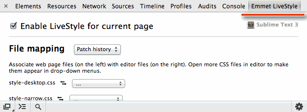
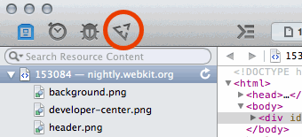

# Emmet LiveStyle: installation and usage

Currently, LiveStyle works as a plugin for Google Chrome, Safari and Sublime Text.

## Google Chrome extension

*Due to closed beta, you have to install this extension manually. Later it will be available in Chrome Webstore.*

1. Download [Chrome extension](http://download.emmet.io/livestyle/livestyle.crx)
2. Drag‘n‘drop downloaded `livestyle.crx` into Extensions page in Chrome settings.

Now you should be able to see **Emmet LiveStyle** panel in DevTools:

## Safari extension

Unfortunately, Safari doesn’t provide API to extend Web Inspector so you have to *hack it*. The LiveStyle extension is developed for latest Webkit Nightly and upcoming OS X Mavericks’ Safari.

1. Download [WebKit Nightly](http://nightly.webkit.org) and install it.
2. Go to `/Applications/WebKit.app/Contents/Frameworks/<YOUR OSX VERSION>/WebInspectorUI.framework/Resources` folder, substitute `<YOUR OSX VERSION>` with your actual OSX version, e.g. `10.8`. You can get there by right-clicking on WebKit app and picking `Show Package Contents` menu item.
3. Download [LiveStyle extension](http://download.emmet.io/livestyle/livestyle-webkit.zip) and unpack its contents into `livestyle` subfolder of your current folder (e.g. `WebInspectorUI.framework/Resources`).
4. Open Web Inspectors’ `Main.html` file in text editor.
5. At the bottom of the `<head>` section, right before `WebInspector.loaded();` call, attach LiveStyle extension: ``.
6. Restart WebKit and open Web Inspector.

If everything installed correctly, you should see Emmet icon on the toolbar:

Note that due to a hacky nature of this extension and fast WebKit Nightly update cycle (updated every day) it can break any time. If you’re happy with current WebKit Nightly build, I recommend to skip all WebKit updates. Otherwise, you have to repeat all installation steps after each update.

## Sublime Text extension

*Due to closed beta, you have to install this extension manually. Later it will be available in Package Control.*

1. Install [Package Control](http://wbond.net/sublime_packages/package_control/installation) first.
2. When installed, open Command Palette in ST editor and pick `Package Control: Add Repository` command.
3. When asked, add the following repo URL: `https://github.com/emmetio/livestyle-sublime`.

When installed, LiveStyle will automatically download require PyV8 extension. 

*NB: if you have Emmet or TernJS extensions installed, make sure you have the most recent versions since they contains updates vital for LiveStyle extension.*

## Usage

To start live CSS edit, simply follow these easy steps:

1. Start Sublime Text and open CSS file or create new one.
2. Start Chrome browser and go to the page you with to edit.
3. Open DevTools, go to Emmet LiveStyle panel and check `Enable LiveStyle for current page` option.
4. When enabled, you’ll see a list of page’s external stylesheets on the left and list of editor files on the right. Simply pick editor file that should be associated with browser one and you are done!

**Important: you must keep DevTools opened during whole live edit session and for every window (in multi-view mode). You can switch to any other panel but DevTools must remain opened.** 

## Workflows

The LiveStyle source patching concept introduces a number of new workflows that you can use in web-site development.

### Simple mode

It’s a basic one-to-one live edit mode: simply associate any external CSS file in browser with editor one and start editing. All your editor changes will be automatically reflected in browser and your DevTools updates will be reflected in editor.

If your browser file is large enough, your editor updates might take some time to apply. If you want to speed things up or you don’t have external stylesheets, you can create a new stylesheet by pressing `Add file` button.

### Multi-view mode

Multi-view mode is ideal for tweaking responsive design. Open multiple windows of the same page and resize them for your RWD breakpoints. *Open DevTools for each window* so it can receive updates. In multi-view mode:

* All editor updates will be applied for all windows.
* All DevTools updates will be applied for all other windows and editor.
* All LiveStyle panel updates (like file associations) will be automatically applied to all other windows

### Multi-site mode

This mode is useful if your web project has different versions of desktop and mobile web-sites but shares the same CSS code base.

As in *Multi-view mode*, open a few windows with your web-sites versions and in LiveStyle panel associate your browser CSS files with *the same editor file*. LiveStyle will use editor file as a reference to patch your browser files with incoming updates.

### Designer mode

*This is an experimental mode and is subject to change.*

This mode is for designers that work on large projects and don’t have direct access to CSS source. 

Imagine you’re such designer and spotted an error in your production web-site. Instead of asking a developer to spend some time with you to fix these issues, you can fix them by yourself and send developer a patch so he can apply it later to original source.

All LiveStyle updates are recorded into “Patch history”, available in LiveStyle DevTools panel. A new patch history entry is created automatically every time you open/refresh web page. Click on “Patch history” popup entry to apply recorded patches, click on red icon on the right to download it.  

So, all you have to do as a designer is to tweak layout in DevTools and download the most recent patch history entry. You can send downloaded patch to developer so he can apply it to original CSS source.

Note that in this mode *you don’t need Sublime Text extension at all*, you just need DevTools extension.

### iOS Safari/web apps tweaking

You can use LiveStyle to tweak CSS in your web/PhoneGap/Titanium apps. LiveStyle integrates directly into Web Inspector so you just need to open it your app/web-site and use as described above.

Note that you can use Safari Web Inspector together with Chrome in *multi-site mode*.